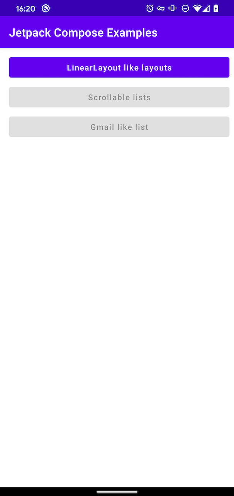

# Compose-playground
Sample project to try out Jetpack Compose. The idea is to explore how some of them common use cases of Android are done when using Jetpack Compose.

# Environment requirements

- Requires Android Studio 4.1 Canary 9+

# Third-party libraries

- **Compose-router**: Used for backstack and navigation https://github.com/zsoltk/compose-router

# App preview and structure

**Module `:app`**: Mainly for creating an activity that will host the ComposeApp

**compose-app**: Module where all the views and screens are implemented 

